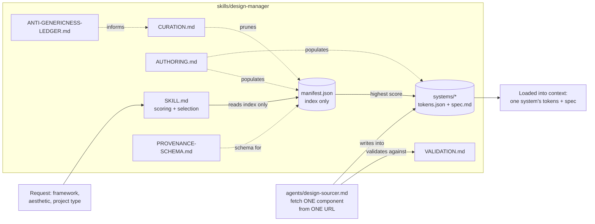

<p align="center">
  
</p>

<p align="center">
  <a href="LICENSE"></a>
  
  
  
</p>

<p align="center">
  A <a href="https://claude.com/claude-code">Claude Code</a> skill system that grounds AI-generated
  UI work in real, curated design systems instead of generic, "AI-default" output.
</p>

---

## Contents

- [Why this exists](#why-this-exists)
- [What's in here](#whats-in-here)
- [How it works](#how-it-works)
- [Architecture](#architecture)
- [Installing](#installing)
- [Worked example](#worked-example)

## Why this exists

Left to its own devices, an LLM asked to "build a dashboard" tends to reach for the same
handful of visual defaults — the same spacing scale, the same card shadow, the same blue.
`design-manager` gives a coding agent a small, curated library of *real* design systems and
a deterministic way to pick the right one for a given request, so the output looks like it
came from an actual design system rather than an LLM's average of every UI it has seen.

## What's in here

```
skills/design-manager/
  SKILL.md                     the skill itself — selection logic, folder/manifest schema
  AUTHORING.md                 fuller methodology for adding a new design system
  CURATION.md                  one-time editorial process for keeping the library distinctive
  PROVENANCE-SCHEMA.md         fuller spec for the provenance fields on each manifest entry
  ANTI-GENERICNESS-LEDGER.md   append-only log of real corrections against generic output
  VALIDATION.md                deterministic pre-merge checks for fetched component source
  manifest.json                the index of curated systems (ships empty — [])
  systems/                     one subfolder per curated design system (ships empty)
agents/
  design-sourcer.md            a narrowly-scoped agent persona for fetching one named
                                component from one named URL — a courier, not a curator
docs/
  walkthrough.md                the worked scoring example, done by hand, step by step
```

The skill ships with an empty `manifest.json` and an empty `systems/` directory. It is a
framework for building your own curated design-system library, not a pre-populated one —
populating it is the "Adding a design system" work described in `SKILL.md` and elaborated
in `AUTHORING.md`.

## How it works

`design-manager` never loads a whole corpus of design systems into context. Instead it
reads a small `manifest.json` index, scores each entry against the request's stated
framework, aesthetic, and project-type tags using a fixed point weighting, and loads only
the single highest-scoring system's `tokens.json` and `spec.md`. Ties break on a curator-set
rank field, then alphabetically. There is no embedding call, no fuzzy matching, and no
network access on the selection path — the whole mechanism is deterministic arithmetic over
exact tag matches, verifiable by hand against the [worked example](docs/walkthrough.md). If
nothing scores above zero, the skill says so explicitly rather than inventing or
half-remembering a system.

The companion documents cover the rest of a design system's lifecycle:

| Document | Role |
|---|---|
| `AUTHORING.md` | Distil an upstream system (component library, docs site, token file) into a compact `tokens.json` + `spec.md` entry — without ever storing the raw source |
| `CURATION.md` | Periodic, human-run editorial pass that removes near-duplicate or generic entries so the library stays distinctive rather than merely large |
| `PROVENANCE-SCHEMA.md` | Fields (`source_url`, `source_version`, `last_verified`) that let a curator confirm an entry still matches upstream |
| `VALIDATION.md` | Mechanical, grep-level checks run against any fetched third-party component before it's copied in |
| `ANTI-GENERICNESS-LEDGER.md` | Append-only log, gated to real user corrections only, of specific things that have made past output look generic |

The `design-sourcer` agent persona is a strictly-scoped fetch-one-file worker: given an
exact URL, an exact component name, and an exact destination, it fetches, validates, and
writes — and refuses to choose a registry, browse a catalog, or curate anything on its own.

## Architecture



## Installing

Copy the two directories into your own Claude Code config:

```
skills/design-manager/   ->  ~/.claude/skills/design-manager/
agents/design-sourcer.md ->  ~/.claude/agents/design-sourcer.md
```

On Windows that's typically `%USERPROFILE%\.claude\skills\design-manager\` and
`%USERPROFILE%\.claude\agents\design-sourcer.md`; on macOS/Linux it's
`~/.claude/skills/design-manager/` and `~/.claude/agents/design-sourcer.md`. No build step,
no dependencies, and no network access are required to use the skill as shipped — it starts
empty and grows only as you (or an authoring pass) add design systems to `manifest.json` and
`systems/`.

## Worked example

See [`docs/walkthrough.md`](docs/walkthrough.md) for the full scoring table, done by hand,
against the fixed example shipped in `SKILL.md` — so you can verify the mechanism before
trusting it on a real request.

## License

[MIT](LICENSE)
